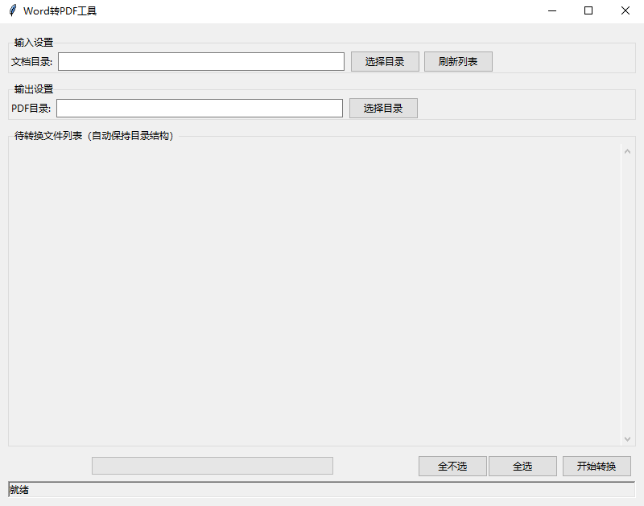

# WordtoPDF 工具
**快速将Word文档转换为PDF的轻量级工具**



## 🌟 核心功能
| 功能模块          | 说明                                                                 |
|-------------------|--------------------------------------------------------------------|
| **多格式支持**     | `.doc/.docx/.docm/.dotx/.dotm/.odt/.rtf` 全格式兼容                                |
| **智能目录识别**   | 自动解析两级文件夹结构：
`父级/子级/文档级`                          |
| **一键批量转换**   | 支持单文件/多文件批量处理，保留原始目录层级                            |
| **路径智能管理**   | 导出路径自动复制导入位置，支持自定义修改                                |

## 🛠️ 技术亮点
```mermaid
graph TD
    A[用户选择文件] --> B{文件类型检测}
    B -->|有效Word文档| C[生成预览列表]
    B -->|无效格式| D[弹出错误提示]
    C --> E[选择输出目录]
    E --> F[启动转换引擎]
    F --> G[生成带书签的PDF]

文件夹结构示例
输入目录：

├── 父级项目/
│   ├── 子级分类/
│   │   ├── 文档A.docx
│   │   └── 文档B.odt
│   └── 其他文件.txt
输出目录：


└── PDF输出/
    ├── 父级项目/
    │   ├── 子级分类/
    │   │   ├── 文档A.pdf
    │   │   └── 文档B.pdf
    └── 其他文件.pdf